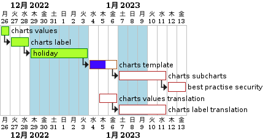

# Schedule

# Procedure
## Download and compile war
```
OhMyTiUP$ git clone https://github.com/springhow/spring-boot-war-example.git
ohMyTiUP$ cd sprint-boot-war-example.git
OhMyTiUP$ mvn package
OhMyTiUP$ sudo cp target/hello-world-0.0.1-SNAPSHOT.war /opt/www/
```

## Nginx unit install
```
OhMyTiUP$ sudo apt-get install unit unit-dev unit-jsc11
```

### Start the config
```
OhMyTiUP$ config.json
{
    "listeners": {
        "*:8080": {
            "pass": "applications/java"
        }
    },
    "applications": {
        "java": {
            "user": "unit",
            "group": "unit",
            "type": "java",
            "environment": {
                "Deployment": "0.0.1"
            },
            "classpath": [],
            "webapp": "/opt/www/hello-world-0.0.1-SNAPSHOT.war"
        }
    }
}
OhMyTiUP$ sudo curl -X PUT --data-binary "@config.json" --unix-socket /var/run/control.unit.sock http://localhost/config/
OhMyTiUP$ sudo curl --unix-socket /var/run/control.unit.sock http://localhost
{
        "certificates": {},
        "config": {
                "listeners": {
                        "*:8080": {
                                "pass": "applications/java"
                        }
                },

                "applications": {
                        "java": {
                                "user": "unit",
                                "group": "unit",
                                "type": "java",
                                "environment": {
                                        "Deployment": "0.0.1"
                                },

                                "classpath": [],
                                "webapp": "/opt/www/hello-world-0.0.1-SNAPSHOT.war"
                        }
                }
        },

        "status": {
                "connections": {
                        "accepted": 2,
                        "active": 0,
                        "idle": 0,
                        "closed": 2
                },

                "requests": {
                        "total": 2
                },

                "applications": {
                        "java": {
                                "processes": {
                                        "running": 1,
                                        "starting": 0,
                                        "idle": 1
                                },

                                "requests": {
                                        "active": 0
                                }
                        }
                }
        }
}
```

## Docker file
```
OhMyTiUP$ docker pull nginx/unit:1.29.0-jsc11
OhMyTiUP$ more Dockerfile
FROM nginx/unit:1.27.0-jsc11

RUN mkdir -p /opt/www

COPY spring-boot-war-example/target/hello-world-0.0.1-SNAPSHOT.war /opt/www/

COPY etc/config.json /docker-entrypoint.d/

EXPOSE 8080

OhMyTiUP$ more etc/config.json
{
    "listeners": {
        "*:8080": {
            "pass": "applications/java"
        }
    },
    "applications": {
        "java": {
            "user": "unit",
            "group": "unit",
            "type": "java",
            "environment": {
                "Deployment": "0.0.1"
            },
            "classpath": [],
            "webapp": "/opt/www/hello-world-0.0.1-SNAPSHOT.war"
        }
    }
}
OhMyTiUP$ docker build . -t test:v0.0.1
Sending build context to Docker daemon  40.25MB
Step 1/5 : FROM nginx/unit:1.27.0-jsc11
 ---> 1021f8eeca68
Step 2/5 : RUN mkdir -p /opt/www
 ---> Using cache
 ---> a42a6028185b
Step 3/5 : COPY spring-boot-war-example/target/hello-world-0.0.1-SNAPSHOT.war /opt/www/
 ---> Using cache
 ---> 815653d5225c
Step 4/5 : COPY etc/config.json /docker-entrypoint.d/
 ---> Using cache
 ---> 32cd04645ba7
Step 5/5 : EXPOSE 8080
 ---> Using cache
 ---> 25803ba4dff8
Successfully built 25803ba4dff8
Successfully tagged test:v0.0.1
OhMyTiUP$ docker run -p 8080:8080 -d test:v0.0.1
OhMyTiUP$ docker ps 
CONTAINER ID        IMAGE               COMMAND                  CREATED              STATUS              PORTS               NAMES
003a61e88211        test:v0.0.1         "/usr/local/bin/dock…"   About a minute ago   Up About a minute   8080/tcp            thirsty_kirch
OhMyTiUP$ curl http://172.82.11.193:8080/
Hello World!
```
