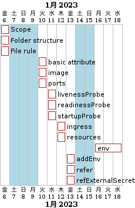

# Schedule

# QA
## apigee xのruntimeはユーザーが設定するものですか[From suzuki]
apigee x's runtime is maintained in GKE by google itself. What user need to do is to define the node and pod yaml file. 

https://cloud.google.com/apigee/docs/api-platform/get-started/what-apigee
https://cloud.google.com/apigee/docs/hybrid/v1.8/scale-and-autoscale#configure-less-aggressive-scaling

## GKEは、Nodeのみスケジュールで増減が設定できるものでしょうか？Podは、設定した最大値でスケールアウトできるあってますか？

https://cloud.google.com/kubernetes-engine/docs/concepts/cluster-autoscaler#autoscaling_limits
https://cloud.google.com/kubernetes-engine/docs/concepts/horizontalpodautoscaler

# helm standard
┗4. ベースマニフェストの作成
┗4.1 構成管理対象成果物
┗4.2 ベースマニフェストの構成管理
┗4.3 設定ファイルの適用ルール
　┗ベースマニフェストのカスタマイズ
　　┗基本属性
　　┗image(コンテナイメージ)
　　┗port
　　┗liveness Probe
　　┗rediness Probe
　　┗startup Probe
　　┗security context
　　┗init container
　　┗service
　　┗ingress
　　┗HPA
　　┗volume
　　┗その他追加設定
