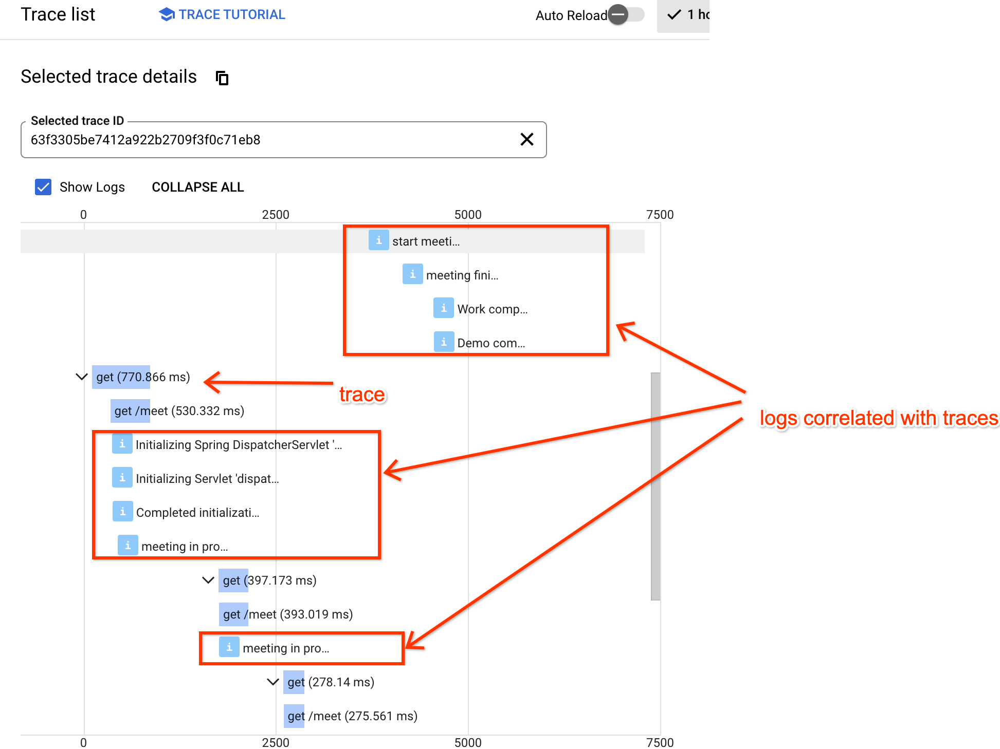
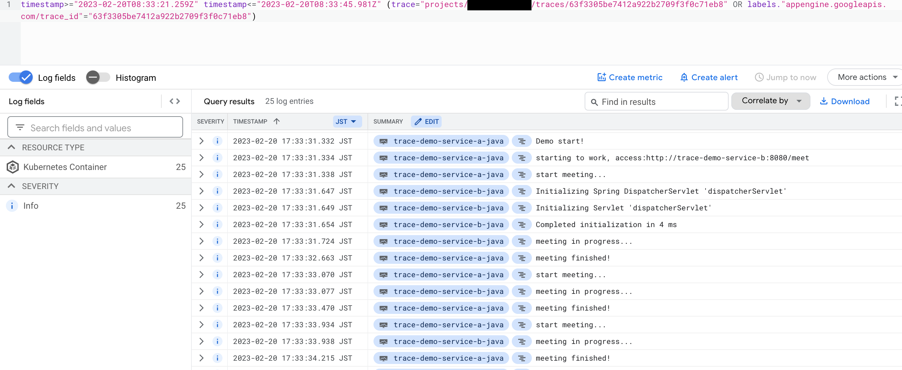

## Trace Details

From Trace details view, the logs are correlated with each traces:



From Cloud Logging console, filter logs with trace id, all the correlated logs can be shown:



Log example:

```
{
insertId: "tuzpewrnjcwf4ue3"
jsonPayload: {
context: "default"
logger: "com.example.demo.WorkController"
message: "meeting finished!"
thread: "http-nio-8080-exec-1"
}
labels: {
compute.googleapis.com/resource_name: "gke-tracing-demo-space-default-pool-07767c4a-muim"
k8s-pod/app: "trace-demo-service-a"
k8s-pod/pod-template-hash: "668d87d85b"
}
logName: "projects/demo-project/logs/stdout"
receiveTimestamp: "2023-02-20T08:33:35.852328243Z"
resource: {
labels: {
cluster_name: "tracing-demo-space"
container_name: "trace-demo-service-a-java"
location: "asia-northeast1-c"
namespace_name: "default"
pod_name: "trace-demo-service-a-668d87d85b-8s7kd"
project_id: "demo-project"
}
type: "k8s_container"
}
severity: "INFO"
spanId: "2b2709f3f0c71eb8"
timestamp: "2023-02-20T08:33:33.470Z"
trace: "projects/demo-project/traces/63f3305be7412a922b2709f3f0c71eb8"
}
```
